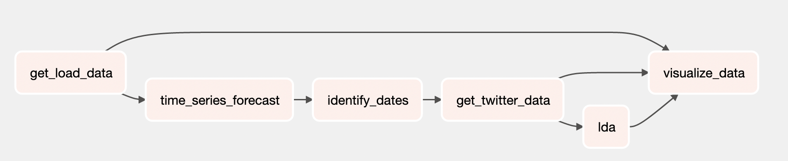

# Energy Demand and Twitter Analysis

Use Big Data Analytics to investigate the relationship between electricity load energy demand and Twitter activity

Group: 
Kevin Mark Murning (kmm2344)
Rifqi Luthfan (rl3154)
Rohan Raghuraman (rr3417)

# Project Description

Effective energy demand forecasting plays a vital role in power systems, especially in resource allocation and economically viable pricing. 
Some trends are easy to infer, for example an increase in demand in winter months due to use of heating. 
However, outlier events can cause spikes in demand that are hard to predict. How can we predict anomalous changes in demand? 
Much work has been done on monitoring social media for time series forecasting but very little has been done in the energy sector.

Our Question: _Can Twitter activity formulated into topics be linked in a causal relationship with energy demand spikes?_

# How to Setup

1. Create a new GCP Project (refer to this documentation: https://cloud.google.com/resource-manager/docs/creating-managing-projects)
    1. Also create a service account (refer to this documentation: https://cloud.google.com/iam/docs/creating-managing-service-accounts) and save the credentials by creating a `credentials` folder in this root folder of the repo
2. Create a new Google Cloud Storage Bucket (refer to this documentation: https://cloud.google.com/storage/docs/creating-buckets)
    1. Create the top level bucket
    2. Create a folder to save the data for the project
    3. Create 3 folders inside the folder created in 2.2
        1. Saving Electricity Load Data
        2. Saving Forecast Results Data
        3. Saving Tweets Data
3. Create a new dataset in Google Big Query (refer to this documentation: https://cloud.google.com/bigquery/docs/datasets)
4. Create a new Google Cloud Dataproc Cluster (refer to this documentation: https://cloud.google.com/dataproc/docs/guides/create-cluster) with installed JUPYTER components and additional libraries needed using this command (don't forget to change the bucket name using the one created in step 2.1):
```
gcloud dataproc clusters create jupyter-cluster \
--optional-components=JUPYTER \
--image-version=preview --enable-component-gateway \
--metadata 'PIP_PACKAGES=requests_oauthlib google-cloud-bigquery spark-nlp plotly pandas-gbq pystan==2.19.1.1 prophet yfinance tweepy==v3.10.0' \
--bucket=<BUCKET_NAME> --region=us-east1 \
--initialization-actions=gs://dataproc-initialization-actions/python/pip-install.sh 
```
5. Collecting Electricity Load Data from NYISO:
    1. Open the notebook titled `00-data-collection-electricity_load.ipynb` in GCloud Dataproc
    2. Change the default constants:
        1. BUCKET_NAME -> use the created Cloud Storage Bucket from step 2.1
        2. PROJECT_BUCKET -> use the folder from step 2.2
        3. FOLDER_NAME -> use the first folder from step 2.3.1
        4. BIG_QUERY_TABLE_NAME -> use the dataset created from step 3
    3. Change the period in the cell for iterating the years and months
        1. Change start end year of for loop
        2. Change start end month of for loop
        3. Change stopping condition in `if ((year==2021) and (month==10)): break`
    4. Run all the cells in the notebook
        1. We are unable to upload the electricity load data
6. Time Series Forecasting:
    1. Open the notebook titled `10-modelling-fbprophet.ipynb` in GCloud Dataproc
    2. Change the default constants:
        1. BUCKET_NAME -> use the same bucket name from step 5.2.1
        2. PROJECT_BUCKET -> use the same folder name from step 5.2.2
        3. FOLDER_NAME -> use the second folder from step 2.3.2
        4. BIG_QUERY_TABLE_NAME -> use the dataset created from step 5 -> use the hourly table
    3. Run all the cells in the notebook
        1. We have uploaded the forecast results data under folder `forecast_data` in this repo
7. Evaluate Forecast and Identify Critical Dates:
    1. Open the notebook titled `12-forecast_results_charts.ipynb` and analyze forecast results (this is a manual process needing domain expert consultation)  in GCloud Dataproc
    2. Open the notebook titled `11-evaluate-model.ipynb` in GCloud Dataproc
    3. Use the same constants from step 6
    4. Change the values of RMSE threshold and anomaly occurence based on analysis in step 7.1
        1. The notebook in the GitHub used `(5 * RMSE)` and `3 anomaly occurence` as threshold
    5. Run all the cells in the notebook and we will have a new CSV files for the dates named `dates_for_twitter.csv` inside the forecast data folder (from step 2.3.2)
8. Get Twitter Data:
    1. Open the notebook `GET_Tweets.ipynb` in "Full Archive Tweets Search" folder
    2. Get Tweets based on identified dates
        1. Manually change the dates based on the results from step 7
        2. Manually change the file names when storing in Storage
    3. Re-run for all dates
        1. We have uploaded the tweets results data under folder `tweets_data` in this repo
9. LDA Topic Modelling: 
    1. Open the `lda` folder
    2. In a python environment, run `pip install requirements.txt` from that folder
    3. run main.py. example: `python main.py --start_date='2020-01-01' --end_date='2021-01-01' --region='all' --tweet_directory='tweets_data'`
    4. HTML of visualization will be output to `lda.html`
    5. Do analysis on LDA results from each area, currently it is done manually and needing domain expert consultation
10. Web Dashboard Visualization:
    1. Create a new Compute Engine Instance (refer to this documentation: https://cloud.google.com/compute/docs/instances/create-start-instance)
    2. Clone this repo in the Instance
    3. In a python environment, run `pip install requirements.txt` from this root folder repo
    4. Under `database_service` folder, open `ElectricityLoadResource.py` and change the `credential_location`, `CREDENTIALS`, `PROJECT_NAME`, and `DB_NAME`
    5. run `streamlit run web_dashboard/app.py`

# Repository Content

## Solution Diagram


## Datasets

1. Time-series electricity load data from NYISO (web scraping from http://dss.nyiso.com/dss_oasis/PublicReports)
    1. Across 15 regions in NY state
    2. 5-mins granularity
    3. From 01/01/2010 to 12/31/2020 for training, 01/01/2021 to 10/31/2021 for validation
2. Forecasting data from FBProphet
    1. Produces energy demand prediction
    2. Using historical comparison we will identify anomalous dates
3. Streamed Twitter data (needs Twitter Full Archive Search API approval)
    1. Region-level top/trending tweets with timestamps
    2. Includes pictures/videos, likes and retweets

## Notebooks

1. `00-data-collection-electricity_load.ipynb` -> data collection from NYISO
2. `10-modelling-fbprophet.ipynb` -> time series forecast using FBProphet
3. `11-evaluate-model.ipynb` -> forecast results evaluation and critical dates identification
4. `12-forecast_results_charts.ipynb` -> scribble notebook used for analyzing trends and seasonality of forecast results
5. `GET_Tweets.ipynb` in "Full Archive Tweets Search" folder -> getting tweets utilizing Twitter Full Archive Search API

## Source Codes

### LDA

1. `load_tweets.py` -> load the collected tweets_data
2. `preprocess_tweets.py` -> text data preprocessing for the tweets
3. `run_LDA.py` -> running the LDA topic modelling
4. `visualize_LDA.py` -> visualize LDA results into bubble chart & bar chart HTML file
5. `main.py` -> main program to run the LDA

### Web Dashboard

1. `app.py` -> main program for the web app
2. `application_service` folder
    1. `BuildingComponents.py` -> contains code to create Line Chart and LDA Visualization components of the web app
3. `database_service` folder
    1. `ElectricityLoadResource.py` -> interfaces with Google BigQuery Database for retrieving electricity load data
    2. `LDAResource.py` -> interfaces with LDA components of this project
